1. Используя команду cat в терминале операционной системы Linux, создать
два файла Домашние животные (заполнив файл собаками, кошками,
хомяками) и Вьючные животными заполнив файл (лошадьми, верблюдами и
ослами ), а затем объединить их. Просмотреть содержимое созданного файла.
Переименовать файл, дав ему новое имя (Друзья человека).


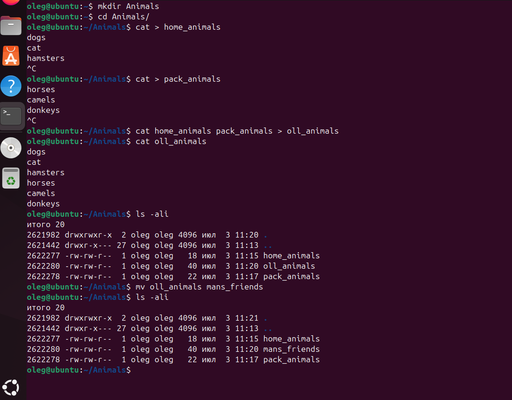

2. Создать директорию, переместить файл туда.

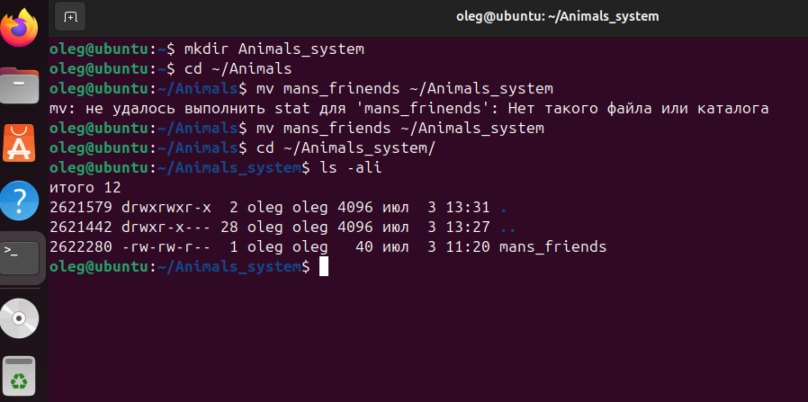

3. Подключить дополнительный репозиторий MySQL. Установить любой пакет
из этого репозитория.

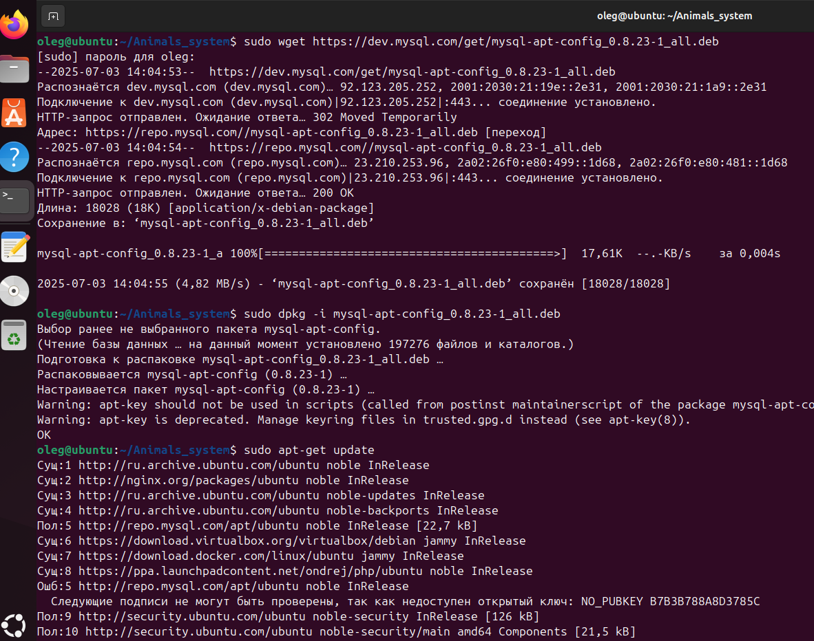
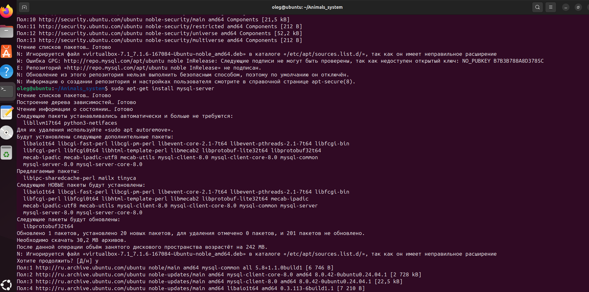
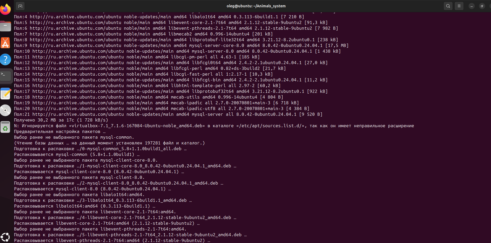
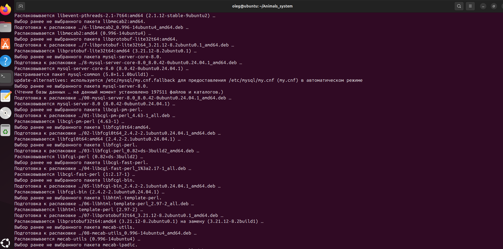
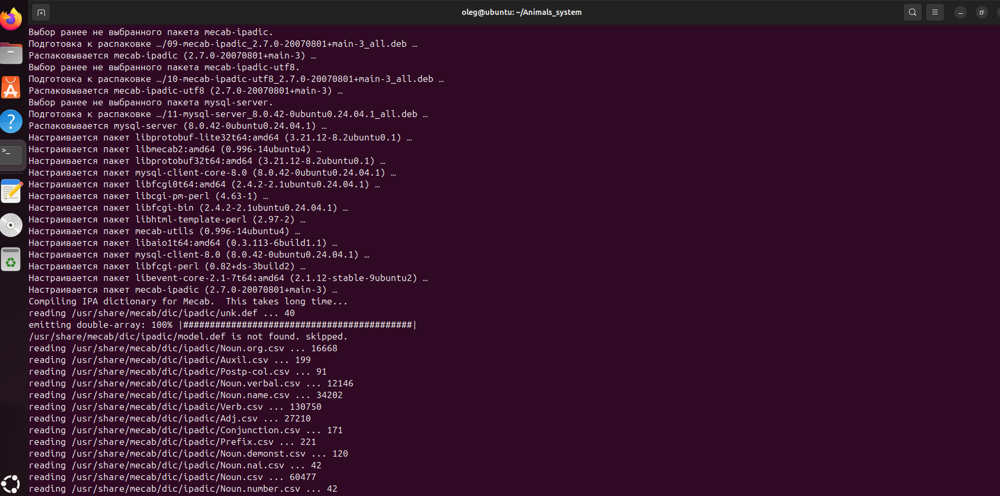
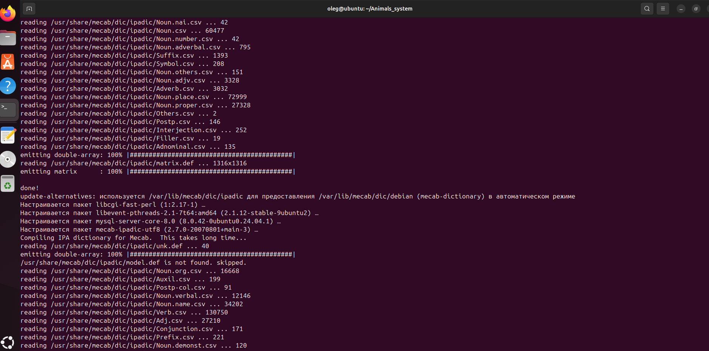
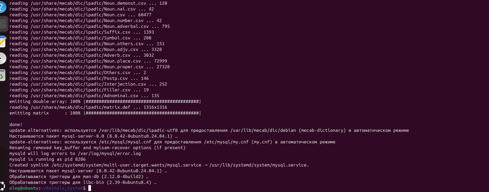

4. Установить и удалить deb-пакет с помощью dpkg.

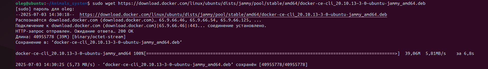


5.Выложить историю команд в терминале ubuntu

История примененных команд в терминале Ubuntu [ЗДЕСЬ](HistoryOfUbuntuTerminalCommands.md)

6. Нарисовать диаграмму, в которой есть класс родительский класс, домашние
животные и вьючные животные, в составы которых в случае домашних
животных войдут классы: собаки, кошки, хомяки, а в класс вьючные животные
войдут: Лошади, верблюды и ослы.

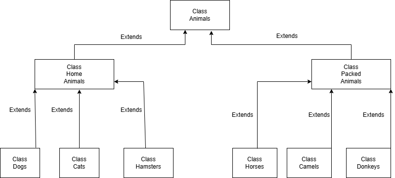

7. В подключенном MySQL репозитории создать базу данных “Друзья
человека”

```sql
CREATE DATABASE Human_friends;
```

8. Создать таблицы с иерархией из диаграммы в БД
```sql
USE Human_friends;
CREATE TABLE animal_classes
(
	Id INT AUTO_INCREMENT PRIMARY KEY, 
	Class_name VARCHAR(20)
);

INSERT INTO animal_classes (Class_name)
VALUES ('вьючные'),
('домашние');  


CREATE TABLE packed_animals
(
	  Id INT AUTO_INCREMENT PRIMARY KEY,
    Genus_name VARCHAR (20),
    Class_id INT,
    FOREIGN KEY (Class_id) REFERENCES animal_classes (Id) ON DELETE CASCADE ON UPDATE CASCADE
);

INSERT INTO packed_animals (Genus_name, Class_id)
VALUES ('Лошади', 1),
('Ослы', 1),  
('Верблюды', 1); 
    
CREATE TABLE home_animals
(
	  Id INT AUTO_INCREMENT PRIMARY KEY,
    Genus_name VARCHAR (20),
    Class_id INT,
    FOREIGN KEY (Class_id) REFERENCES animal_classes (Id) ON DELETE CASCADE ON UPDATE CASCADE
);

INSERT INTO home_animals (Genus_name, Class_id)
VALUES ('Кошки', 2),
('Собаки', 2),  
('Хомяки', 2); 

CREATE TABLE cats 
(       
    Id INT AUTO_INCREMENT PRIMARY KEY, 
    Name VARCHAR(20), 
    Birthday DATE,
    Commands VARCHAR(50),
    Genus_id int,
    Foreign KEY (Genus_id) REFERENCES home_animals (Id) ON DELETE CASCADE ON UPDATE CASCADE
);
```

9. Заполнить низкоуровневые таблицы именами(животных), командами
которые они выполняют и датами рождения
```sql
INSERT INTO cats (Name, Birthday, Commands, Genus_id)
VALUES ('Пупа', '2011-01-01', 'кс-кс-кс', 1),
('Олег', '2016-01-01', "отставить!", 1),  
('Тьма', '2017-01-01', "", 1); 

CREATE TABLE dogs 
(       
    Id INT AUTO_INCREMENT PRIMARY KEY, 
    Name VARCHAR(20), 
    Birthday DATE,
    Commands VARCHAR(50),
    Genus_id int,
    Foreign KEY (Genus_id) REFERENCES home_animals (Id) ON DELETE CASCADE ON UPDATE CASCADE
);
INSERT INTO dogs (Name, Birthday, Commands, Genus_id)
VALUES ('Дик', '2020-01-01', 'ко мне, лежать, лапу, голос', 2),
('Граф', '2021-06-12', "сидеть, лежать, лапу", 2),  
('Шарик', '2018-05-01', "сидеть, лежать, лапу, след, фас", 2), 
('Босс', '2021-05-10', "сидеть, лежать, фу, место", 2);

CREATE TABLE hamsters 
(       
    Id INT AUTO_INCREMENT PRIMARY KEY, 
    Name VARCHAR(20), 
    Birthday DATE,
    Commands VARCHAR(50),
    Genus_id int,
    Foreign KEY (Genus_id) REFERENCES home_animals (Id) ON DELETE CASCADE ON UPDATE CASCADE
);
INSERT INTO hamsters (Name, Birthday, Commands, Genus_id)
VALUES ('Малой', '2020-10-12', '', 3),
('Соня', '2021-03-12', "атака сверху", 3),  
('Лень', '2022-07-11', NULL, 3), 
('Обжора', '2022-05-10', NULL, 3);

CREATE TABLE horses 
(       
    Id INT AUTO_INCREMENT PRIMARY KEY, 
    Name VARCHAR(20), 
    Birthday DATE,
    Commands VARCHAR(50),
    Genus_id int,
    Foreign KEY (Genus_id) REFERENCES packed_animals (Id) ON DELETE CASCADE ON UPDATE CASCADE
);
INSERT INTO horses (Name, Birthday, Commands, Genus_id)
VALUES ('Звездв', '2020-01-12', 'бегом, шагом', 1),
('Быстрый', '2017-03-12', "бегом, шагом, хоп", 1),  
('Жулик', '2016-07-12', "бегом, шагом, хоп, брр", 1), 
('Молния', '2020-11-10', "бегом, шагом, хоп", 1);

CREATE TABLE donkeys 
(       
    Id INT AUTO_INCREMENT PRIMARY KEY, 
    Name VARCHAR(20), 
    Birthday DATE,
    Commands VARCHAR(50),
    Genus_id int,
    Foreign KEY (Genus_id) REFERENCES packed_animals (Id) ON DELETE CASCADE ON UPDATE CASCADE
);
INSERT INTO donkeys (Name, Birthday, Commands, Genus_id)
VALUES ('Ушастый', '2019-04-10', NULL, 2),
('Ушастый2', '2020-03-12', "", 2),  
('Ушастый3', '2021-07-12', "", 2), 
('Ушастый4', '2022-12-10', NULL, 2);

CREATE TABLE camels 
(       
    Id INT AUTO_INCREMENT PRIMARY KEY, 
    Name VARCHAR(20), 
    Birthday DATE,
    Commands VARCHAR(50),
    Genus_id int,
    Foreign KEY (Genus_id) REFERENCES packed_animals (Id) ON DELETE CASCADE ON UPDATE CASCADE
);
INSERT INTO camels (Name, Birthday, Commands, Genus_id)
VALUES ('Горбатый', '2022-04-10', 'вернись', 3),
('Холм', '2019-03-12', "остановись", 3),  
('Крик', '2015-07-12', "повернись", 3), 
('Губа', '2022-12-10', "лежать", 3);